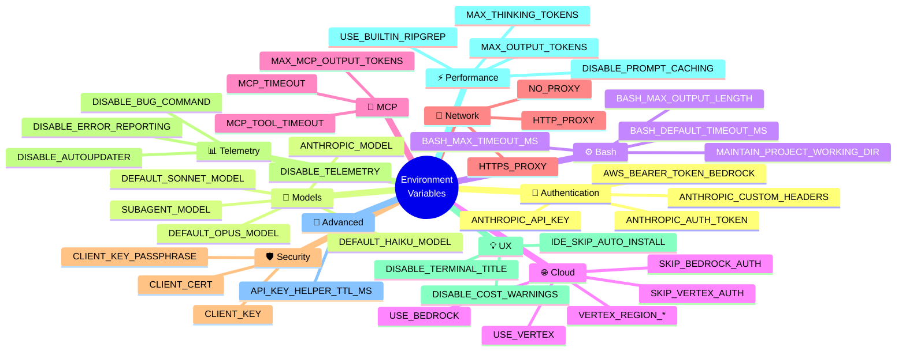
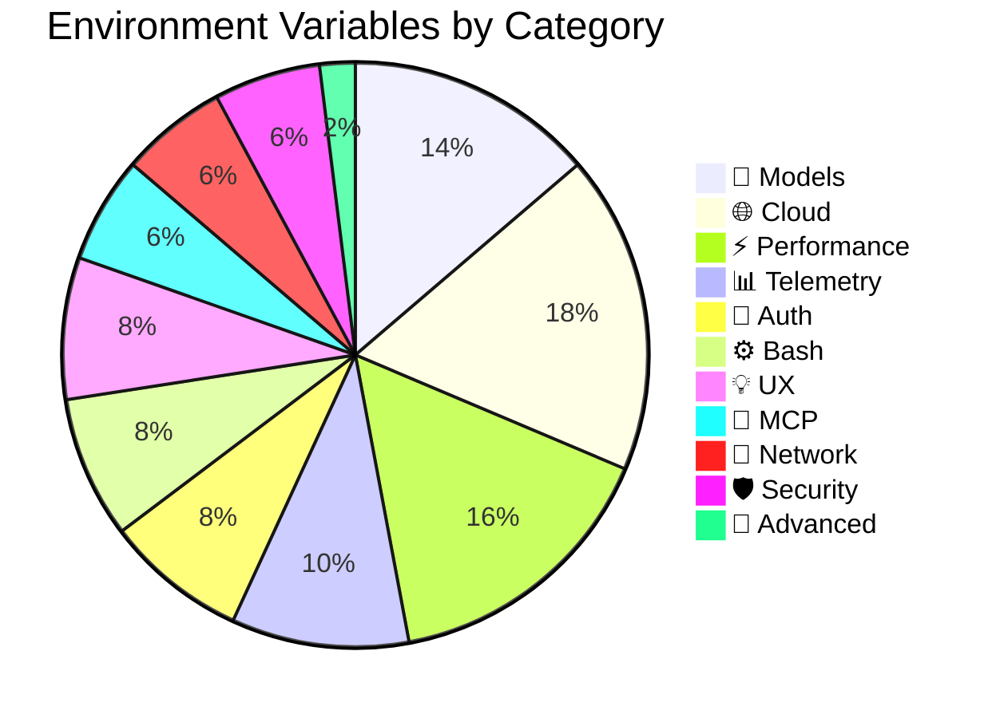

# Environment Variables Diagram

This diagram shows all Claude Code environment variables organized by category.

```mermaid
graph TB
    Root[Environment Variables]

    Root --> Auth[🔐 Authentication and API]
    Root --> Models[🤖 Model Configuration]
    Root --> Bash[⚙️ Bash and Command Execution]
    Root --> Cloud[🌐 Cloud Infrastructure]
    Root --> MCP[🔌 MCP]
    Root --> Network[🔄 Proxy and Network]
    Root --> Security[🛡️ Security and Certificates]
    Root --> Telemetry[📊 Telemetry and Debugging]
    Root --> UX[💡 UX and Behavior]
    Root --> Performance[⚡ Optimization and Performance]
    Root --> Advanced[🔧 Advanced Configuration]

    Auth --> Auth1[ANTHROPIC_API_KEY]
    Auth --> Auth2[ANTHROPIC_AUTH_TOKEN]
    Auth --> Auth3[ANTHROPIC_CUSTOM_HEADERS]
    Auth --> Auth4[AWS_BEARER_TOKEN_BEDROCK]

    Models --> Model1[ANTHROPIC_MODEL]
    Models --> Model2[ANTHROPIC_DEFAULT_HAIKU_MODEL]
    Models --> Model3[ANTHROPIC_DEFAULT_OPUS_MODEL]
    Models --> Model4[ANTHROPIC_DEFAULT_SONNET_MODEL]
    Models --> Model5[ANTHROPIC_SMALL_FAST_MODEL<br/>DEPRECATED]
    Models --> Model6[ANTHROPIC_SMALL_FAST_MODEL_AWS_REGION]
    Models --> Model7[CLAUDE_CODE_SUBAGENT_MODEL]

    Bash --> Bash1[BASH_DEFAULT_TIMEOUT_MS]
    Bash --> Bash2[BASH_MAX_TIMEOUT_MS]
    Bash --> Bash3[BASH_MAX_OUTPUT_LENGTH]
    Bash --> Bash4[CLAUDE_BASH_MAINTAIN_PROJECT_WORKING_DIR]

    Cloud --> Cloud1[CLAUDE_CODE_USE_BEDROCK]
    Cloud --> Cloud2[CLAUDE_CODE_USE_VERTEX]
    Cloud --> Cloud3[CLAUDE_CODE_SKIP_BEDROCK_AUTH]
    Cloud --> Cloud4[CLAUDE_CODE_SKIP_VERTEX_AUTH]
    Cloud --> Cloud5[VERTEX_REGION_CLAUDE_3_5_HAIKU]
    Cloud --> Cloud6[VERTEX_REGION_CLAUDE_3_7_SONNET]
    Cloud --> Cloud7[VERTEX_REGION_CLAUDE_4_0_OPUS]
    Cloud --> Cloud8[VERTEX_REGION_CLAUDE_4_0_SONNET]
    Cloud --> Cloud9[VERTEX_REGION_CLAUDE_4_1_OPUS]

    MCP --> MCP1[MCP_TIMEOUT]
    MCP --> MCP2[MCP_TOOL_TIMEOUT]
    MCP --> MCP3[MAX_MCP_OUTPUT_TOKENS]

    Network --> Net1[HTTP_PROXY]
    Network --> Net2[HTTPS_PROXY]
    Network --> Net3[NO_PROXY]

    Security --> Sec1[CLAUDE_CODE_CLIENT_CERT]
    Security --> Sec2[CLAUDE_CODE_CLIENT_KEY]
    Security --> Sec3[CLAUDE_CODE_CLIENT_KEY_PASSPHRASE]

    Telemetry --> Tel1[DISABLE_TELEMETRY]
    Telemetry --> Tel2[DISABLE_ERROR_REPORTING]
    Telemetry --> Tel3[DISABLE_BUG_COMMAND]
    Telemetry --> Tel4[DISABLE_AUTOUPDATER]
    Telemetry --> Tel5[CLAUDE_CODE_DISABLE_NONESSENTIAL_TRAFFIC]

    UX --> UX1[CLAUDE_CODE_DISABLE_TERMINAL_TITLE]
    UX --> UX2[DISABLE_COST_WARNINGS]
    UX --> UX3[DISABLE_NON_ESSENTIAL_MODEL_CALLS]
    UX --> UX4[CLAUDE_CODE_IDE_SKIP_AUTO_INSTALL]

    Performance --> Perf1[CLAUDE_CODE_MAX_OUTPUT_TOKENS]
    Performance --> Perf2[MAX_THINKING_TOKENS]
    Performance --> Perf3[DISABLE_PROMPT_CACHING]
    Performance --> Perf4[DISABLE_PROMPT_CACHING_HAIKU]
    Performance --> Perf5[DISABLE_PROMPT_CACHING_OPUS]
    Performance --> Perf6[DISABLE_PROMPT_CACHING_SONNET]
    Performance --> Perf7[SLASH_COMMAND_TOOL_CHAR_BUDGET]
    Performance --> Perf8[USE_BUILTIN_RIPGREP]

    Advanced --> Adv1[CLAUDE_CODE_API_KEY_HELPER_TTL_MS]

    classDef authStyle fill:#ff6b6b,stroke:#c92a2a,color:#fff
    classDef modelStyle fill:#4ecdc4,stroke:#0a8a8a,color:#fff
    classDef bashStyle fill:#95e1d3,stroke:#38ada9,color:#000
    classDef cloudStyle fill:#a8e6cf,stroke:#56ab91,color:#000
    classDef mcpStyle fill:#ffd93d,stroke:#f4a261,color:#000
    classDef networkStyle fill:#6bcf7f,stroke:#2a9d8f,color:#fff
    classDef securityStyle fill:#c77dff,stroke:#9d4edd,color:#fff
    classDef telemetryStyle fill:#ff9770,stroke:#e76f51,color:#fff
    classDef uxStyle fill:#a8dadc,stroke:#457b9d,color:#000
    classDef perfStyle fill:#ffc6ff,stroke:#e0aaff,color:#000
    classDef advStyle fill:#b8b8ff,stroke:#7b68ee,color:#fff

    class Auth,Auth1,Auth2,Auth3,Auth4 authStyle
    class Models,Model1,Model2,Model3,Model4,Model5,Model6,Model7 modelStyle
    class Bash,Bash1,Bash2,Bash3,Bash4 bashStyle
    class Cloud,Cloud1,Cloud2,Cloud3,Cloud4,Cloud5,Cloud6,Cloud7,Cloud8,Cloud9 cloudStyle
    class MCP,MCP1,MCP2,MCP3 mcpStyle
    class Network,Net1,Net2,Net3 networkStyle
    class Security,Sec1,Sec2,Sec3 securityStyle
    class Telemetry,Tel1,Tel2,Tel3,Tel4,Tel5 telemetryStyle
    class UX,UX1,UX2,UX3,UX4 uxStyle
    class Performance,Perf1,Perf2,Perf3,Perf4,Perf5,Perf6,Perf7,Perf8 perfStyle
    class Advanced,Adv1 advStyle
```

## Alternative View: Mindmap

```mermaid
mindmap
  root((Environment<br/>Variables))
    🔐 Authentication
      ANTHROPIC_API_KEY
      ANTHROPIC_AUTH_TOKEN
      ANTHROPIC_CUSTOM_HEADERS
      AWS_BEARER_TOKEN_BEDROCK
    🤖 Models
      ANTHROPIC_MODEL
      DEFAULT_HAIKU_MODEL
      DEFAULT_OPUS_MODEL
      DEFAULT_SONNET_MODEL
      SUBAGENT_MODEL
    ⚙️ Bash
      BASH_DEFAULT_TIMEOUT_MS
      BASH_MAX_TIMEOUT_MS
      BASH_MAX_OUTPUT_LENGTH
      MAINTAIN_PROJECT_WORKING_DIR
    🌐 Cloud
      USE_BEDROCK
      USE_VERTEX
      SKIP_BEDROCK_AUTH
      SKIP_VERTEX_AUTH
      VERTEX_REGION_*
    🔌 MCP
      MCP_TIMEOUT
      MCP_TOOL_TIMEOUT
      MAX_MCP_OUTPUT_TOKENS
    🔄 Network
      HTTP_PROXY
      HTTPS_PROXY
      NO_PROXY
    🛡️ Security
      CLIENT_CERT
      CLIENT_KEY
      CLIENT_KEY_PASSPHRASE
    📊 Telemetry
      DISABLE_TELEMETRY
      DISABLE_ERROR_REPORTING
      DISABLE_BUG_COMMAND
      DISABLE_AUTOUPDATER
    💡 UX
      DISABLE_TERMINAL_TITLE
      DISABLE_COST_WARNINGS
      IDE_SKIP_AUTO_INSTALL
    ⚡ Performance
      MAX_OUTPUT_TOKENS
      MAX_THINKING_TOKENS
      DISABLE_PROMPT_CACHING
      USE_BUILTIN_RIPGREP
    🔧 Advanced
      API_KEY_HELPER_TTL_MS
```

## Category Statistics

```mermaid
pie title Environment Variables by Category
    "🤖 Models" : 7
    "🌐 Cloud" : 9
    "⚡ Performance" : 8
    "📊 Telemetry" : 5
    "🔐 Auth" : 4
    "⚙️ Bash" : 4
    "💡 UX" : 4
    "🔌 MCP" : 3
    "🔄 Network" : 3
    "🛡️ Security" : 3
    "🔧 Advanced" : 1
```
