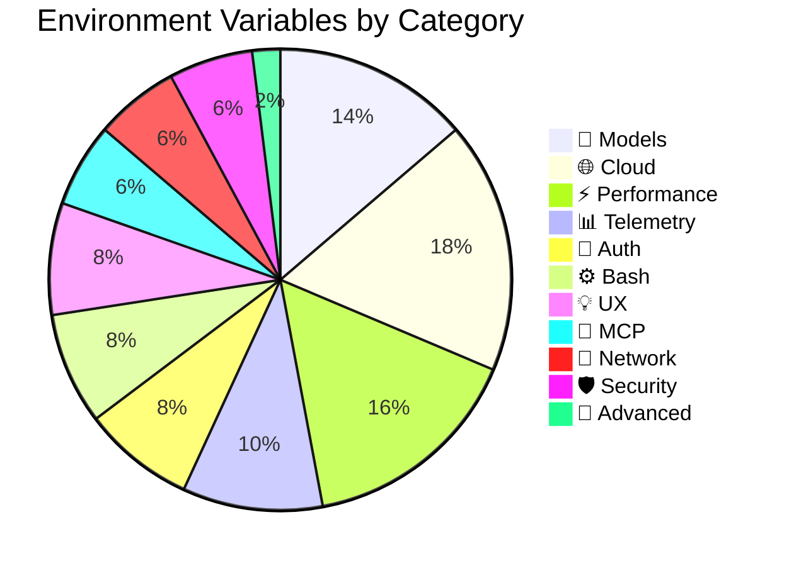

# Environment Variables Summary

## Variables by Category

| Category | Variables | Count |
|----------|-----------|-------|
| 🔐 **Authentication and API** | `ANTHROPIC_API_KEY` `ANTHROPIC_AUTH_TOKEN` `ANTHROPIC_CUSTOM_HEADERS` `AWS_BEARER_TOKEN_BEDROCK` | 4 |
| 🤖 **Model Configuration** | `ANTHROPIC_MODEL` `ANTHROPIC_DEFAULT_HAIKU_MODEL` `ANTHROPIC_DEFAULT_OPUS_MODEL` `ANTHROPIC_DEFAULT_SONNET_MODEL` `ANTHROPIC_SMALL_FAST_MODEL` (deprecated) `ANTHROPIC_SMALL_FAST_MODEL_AWS_REGION` `CLAUDE_CODE_SUBAGENT_MODEL` | 7 |
| ⚙️ **Bash and Command Execution** | `BASH_DEFAULT_TIMEOUT_MS` `BASH_MAX_TIMEOUT_MS` `BASH_MAX_OUTPUT_LENGTH` `CLAUDE_BASH_MAINTAIN_PROJECT_WORKING_DIR` | 4 |
| 🌐 **Cloud Infrastructure** | `CLAUDE_CODE_USE_BEDROCK` `CLAUDE_CODE_USE_VERTEX` `CLAUDE_CODE_SKIP_BEDROCK_AUTH` `CLAUDE_CODE_SKIP_VERTEX_AUTH` `VERTEX_REGION_CLAUDE_3_5_HAIKU` `VERTEX_REGION_CLAUDE_3_7_SONNET` `VERTEX_REGION_CLAUDE_4_0_OPUS` `VERTEX_REGION_CLAUDE_4_0_SONNET` `VERTEX_REGION_CLAUDE_4_1_OPUS` | 9 |
| 🔌 **MCP (Model Context Protocol)** | `MCP_TIMEOUT` `MCP_TOOL_TIMEOUT` `MAX_MCP_OUTPUT_TOKENS` | 3 |
| 🔄 **Proxy and Network** | `HTTP_PROXY` `HTTPS_PROXY` `NO_PROXY` | 3 |
| 🛡️ **Security and Certificates** | `CLAUDE_CODE_CLIENT_CERT` `CLAUDE_CODE_CLIENT_KEY` `CLAUDE_CODE_CLIENT_KEY_PASSPHRASE` | 3 |
| 📊 **Telemetry and Debugging** | `DISABLE_TELEMETRY` `DISABLE_ERROR_REPORTING` `DISABLE_BUG_COMMAND` `DISABLE_AUTOUPDATER` `CLAUDE_CODE_DISABLE_NONESSENTIAL_TRAFFIC` | 5 |
| 💡 **UX and Behavior** | `CLAUDE_CODE_DISABLE_TERMINAL_TITLE` `DISABLE_COST_WARNINGS` `DISABLE_NON_ESSENTIAL_MODEL_CALLS` `CLAUDE_CODE_IDE_SKIP_AUTO_INSTALL` | 4 |
| ⚡ **Optimization and Performance** | `CLAUDE_CODE_MAX_OUTPUT_TOKENS` `MAX_THINKING_TOKENS` `DISABLE_PROMPT_CACHING` `DISABLE_PROMPT_CACHING_HAIKU` `DISABLE_PROMPT_CACHING_OPUS` `DISABLE_PROMPT_CACHING_SONNET` `SLASH_COMMAND_TOOL_CHAR_BUDGET` `USE_BUILTIN_RIPGREP` | 8 |
| 🔧 **Advanced Configuration** | `CLAUDE_CODE_API_KEY_HELPER_TTL_MS` | 1 |

---

## Quick Reference Table

| Category | Count | Key Variables |
|----------|-------|---------------|
| 🔐 Authentication and API | 4 | API keys, auth tokens, custom headers |
| 🤖 Model Configuration | 7 | Model selection, aliases, and subagent models |
| ⚙️ Bash and Command Execution | 4 | Timeouts, output limits, working directory |
| 🌐 Cloud Infrastructure | 9 | Bedrock, Vertex AI, regional configuration |
| 🔌 MCP | 3 | Timeouts and output limits for MCP tools |
| 🔄 Proxy and Network | 3 | HTTP/HTTPS proxy configuration |
| 🛡️ Security and Certificates | 3 | mTLS client certificates and keys |
| 📊 Telemetry and Debugging | 5 | Disable telemetry, error reporting, updates |
| 💡 UX and Behavior | 4 | Terminal title, cost warnings, IDE behavior |
| ⚡ Optimization and Performance | 8 | Token limits, caching, thinking budget |
| 🔧 Advanced Configuration | 1 | API key helper refresh interval |

**Total: 51 environment variables**

---

## Distribution Chart

