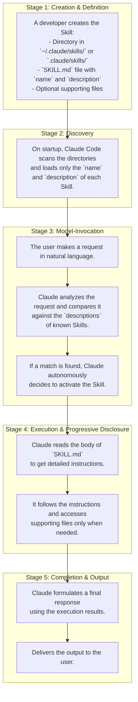

# Skill Lifecycle in Claude Code

```mermaid
graph TD
    %% Skill Lifecycle Flowchart in Claude Code

    subgraph "Stage 1: Creation & Definition"
        A["A developer creates the Skill:<br/>- Directory in `~/.claude/skills/` or `.claude/skills/`<br/>- `SKILL.md` file with `name` and `description`<br/>- Optional supporting files"]
    end

    subgraph "Stage 2: Discovery"
        B["On startup, Claude Code scans the directories<br/>and loads only the `name` and `description` of each Skill."]
    end

    subgraph "Stage 3: Model-Invocation"
        C["The user makes a request in natural language."]
        D["Claude analyzes the request and compares it<br/>against the `descriptions` of known Skills."]
        E["If a match is found, Claude autonomously<br/>decides to activate the Skill."]
    end

    subgraph "Stage 4: Execution & Progressive Disclosure"
        F["Claude reads the body of `SKILL.md`<br/>to get detailed instructions."]
        G["It follows the instructions and accesses<br/>supporting files only when needed."]
    end

    subgraph "Stage 5: Completion & Output"
        H["Claude formulates a final response<br/>using the execution results."]
        I["Delivers the output to the user."]
    end

    %% Flow Connections
    A --> B
    B --> C
    C --> D
    D --> E
    E --> F
    F --> G
    G --> H
    H --> I
```